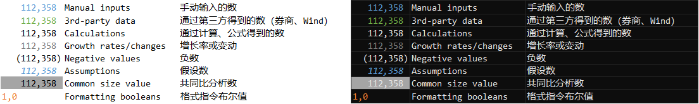

# privatefund-journalentries

Extracts relevant transaction information and converts to accounting journal entries in accordance with IFRS; assumed entity is a private investment fund 

Returns a Statement of Comprehensive Income (denoted SCI), Statement of Financial Position (SFP), Statement of Cash Flows (SCF), Statement of Changes in Net Asset Value (SCNAV), and Investment Schedule (IS); the IS is considered a more specific subset of the SFP, detailing positions in specific securities at the end of the recording period

## Transaction records template

Transactions which are fully mapped are recorded in a pandas dataframe with the following columns: 

Index(['Init_date',
       'Settle_date',
       'Institution',
       'Account_name',
       'Account_num',
       'Description',
       'Asset_type',
       'Security_code',
       'Security_name',
       'Trxn_value',
       'Trxn_value_curr',
       'Trxn_quantity',
       'Trxn_price',
       'Trxn_price_curr',
       'DR_account_0',
       'DR_value_0',
       'CR_account_0',
       'CR_value_0',
       'DR_account_1',
       'DR_value_1',
       'CR_account_1',
       'CR_value_1',
       'DR_account_2',
       'DR_value_2',
       'CR_account_2',
       'CR_value_2',
      ], dtype='object')

The initial transactions (pre debit/credit journal entry mapping) are recorded in a spreadsheet with the same columns as headers minus the DR and CR column names. 
The abbreviation used for 'Transaction' is 'trxn' rather than the more conventional 'txn'. This is done to avoid potential confusion with 'tax'. 

## AFS financial asset journal entry example

This example is built upon 'View B' of: https://viewpoint.pwc.com/dt/us/en/pwc/accounting_guides/loans_and_investment/loans_and_investment_US/chapter_3_accounting__1_US/34_accounting_for_de_US.html#pwc-topic.dita_1609305310049078

Given following hypothetical data on ABC company:

|Month|ABC.XNYS price|ABC.XNYS shares|XR HKD/USD |
|:---:|         ---: |          ---: |      ---: |
|0    |11 USD        |150 shares     |7.1        |
|1    |13 USD        |150 shares     |7.3        |
|2    |9 USD         |150 shares     |7.7        |
|3    |12 USD        |150 shares     |6.7        |

Assume our presentation AND functional currency are both in **HKD**. 

I will use a custom, more intuitive format for exchange rates (XR) labels. Instead of BaseCurrencyCode.QuoteCurrencyCode as is convention, XR formats will be as follows: 
QuoteCurrencyCode/BaseCurrencyCode. For example, 7.7891 USD.HKD will be formatted as 7.7891 HKD/USD. 

Then month 0 journal entries would be: 

|DR/CR|Account                           |Value|Currency|Commentary|
|:---:| :---                             |---: | :---   | :---     |
|DR   |SFP_A_FA_E_USD_BV                 |1650 |USD     |This is actually specific to the security, eg SFP_A_FA_E_USD_BV_ABC.XNYS, but this level of specificity is only in the IS, and what shows up on the financial statements is still SFP_A_FA_E_USD_BV consolidated across denoted in the same foreign currency. securities |
|CR   |  SFP_A_CCE_USD (SCF_OA_PPI_USD) |1650 |USD     |          |

Then the NAV at the end of the month 0 would change by: 1650 USD * 7.1 HKD/USD = 11,715 HKD 

Month 1 journal entries would be: 

|DR/CR|Account                        |Value|Currency|Commentary|
|:---:| :---                          |---: | :---   | :---     |
|DR   |SFP_A_FA_E_USD_CUM_UGLΔFV      |300  |USD     |((13 - 11 USD)*150 Shares); the asset appreciated (gain) therefore debit (increase) the adjunct asset account that tracks cumulative valuation allowances; translated using _this_ period's exchange rate during SFP assets summation|
|CR   |  SCI_OCI_UGLFA_ΔFV_USD        |300  |USD     |The asset appreciated (gain) therefore record this as unrealized income in the SCI|

Assuming there is only 1,650 USD worth of assets and no liabilities on the books in the previous period, the NAV XR adjustment would be ΔXR * NA_{t0} = (7.3 - 7.1 HKD/USD) * 1650 USD = 330 HKD

Then NAV this period would increase by 300 USD * 7.3 HKD/USD = 2,190 HKD and the 330 HKD XR adjustment = 2,520 HKD， and end period NAV should be 11,715 HKD + 2,520 HKD = 14,235 HKD

Conceptually, the 330 HKD XR adjustment is added to last period's financial asset value (in functional currency) to make it comparable (same XR) to this period's changes in NAV from PL. The 2,520 HKD change to NAV can be broken down into mark-to-market effects of fair value (2,190) and FX effects on fair value (330). 

Month 2 journal entries would be: 

|DR/CR|Account                        |Value|Currency|Commentary|
|:---:| :---                          |---: | :---   | :---     |
|DR   |SCI_OCI_UGLFA_ΔFV_USD          |600  |USD     |(9-13 USD)*150 Shares; the asset depreciated (loss) therefore record this as unrealized expense in SCI; translated using _this_ period's exchange rate during SFP assets summation|
|CR   |  SFP_A_FA_E_USD_CUM_UGLΔFV    |600  |USD     |The asset depreciated (loss) therefore credit (decrease) the asset account that tracks cum. fair value adjustments; the account as a whole is now currently at a negative balance|

Assuming there is only 1,650 USD + 300 USD = 1,950 USD worth of net assets in the previous period, the NAV XR adjustment would be ΔXR * NA_{t0} = (7.7 - 7.3 HKD/USD) * 1,950 USD =  780 HKD, representing a favorable exchange rate gain of 780 HKD

Then NAV this period would first increase by the 780 HKD XR adjustment, then decrease by (600 USD * 7.7 HKD/USD = 4,620 HKD) from FVOCI adjustment.

Therefore, end period NAV would be 14,235 HKD + 780 HKD - 4,620 HKD = 10,395 HKD

Assuming sale at the end of month 3, the journal entries would be:

|DR/CR|Account                        |Value  |Currency|Commentary|
|:---:| :---                          |---:   | :---   | :---     |
|DR   |SFP_A_CCE_USD (SCF_OA_PSI_USD) |1,800  |USD     |Sold 150 shares * 12 USD per share (average selling price)|
|CR   |  SFP_A_FA_E_USD_CUM_UGLΔFV    |1,650  |USD     |Sold 150 shares * 11 USD per share (use average book price instead of FIFO or LIFO; is this a variable you should retain as a function/method input param?) |
|CR   |  SCI_I_RGLFA_USD              |150    |USD     |(12 USD - 11 USD) * 150 Shares|
|DR   |SFP_A_FA_E_USD_CUM_UGLΔFV      |300    |USD     |Had a 300 USD CR (cum. loss) balance at end of last period/beginning of this period; actual _net_ carrying value of 1,350 USD; close out _pro rata_ portion (150 shares sold/150 shares held * 300 USD CR balance)|
|CR   |  SCI_OCI_UGLFA_ΔFV_USD        |300    |USD     |Close out the outstanding OCI of SCI, makes no difference towards the end of SCNAV; this entry essentially moves the unrealized portion (OCI) of the gain to the realized portion (income)|

Assuming there is only 1,650 USD (carrying amount at last period of record) + 300 USD - 600 USD = 1,350 HKD worth of net assets in the previous period, the NAV XR adjustment would be ΔXR * NA_{t0} = (6.7 - 7.7 HKD/USD) * 1,350 USD =  -1,350 HKD

Then NAV this period would first decrease by the 1,350 HKD XR adjustment, then increase by _450_ USD * 6.7 HKD/USD = 3,015 HKD

Where did the 450 USD figure come from? At point of sale, assets went up (cash) by 1,800 USD and down (financial assets book) by 1,650 USD and then up (financial asset adjunct) by 300 USD again for net up by 450 USD; 
NAV (equity) went up by 150 USD and 300 USD for net 450 USD through SCI carry-over

End period NAV should be 10,395 HKD - 1,350 HKD + 3,015 HKD = 12,060 HKD

Glossary: 
|Account abbreviation          |Account name|
|------------------------------|------------|
|SFP_A_FA_E_USD_BV             |SFP; Assets; Financial Assets; Equity; USD account; Book Value|
|SFP_A_CCE_USD                 |SFP; Assets; Cash & Cash Equivalents; USD account|
|SCF_OA_PPI_USD                |SCF; Operating Activities; Payments for Purchases of Investments|
|SCF_OA_PSI_USD                |SCF; Operating Activities; Proceeds on Sales of Investments|
|SFP_A_FA_E_USD_CUM_UGLΔFV     |SFP; Assets; Financial Assets; Equity; USD account; Cumulative Urealized Gain/Loss changes to Fair Value|
|SCI_OCI_UGLFA_ΔFV_USD         |SCI; Other Comprehensive Income; Unrealized Gain/Loss on Financial Assets; Changes to Fair Value; USD account |
|SCI_I_RGLFA_USD               |SCI; Income; Realized Gain/Loss on Financial Assets; USD account|

## Spreadsheet formatting legend

